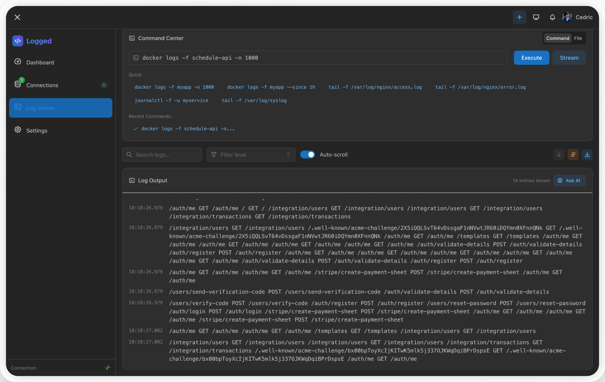
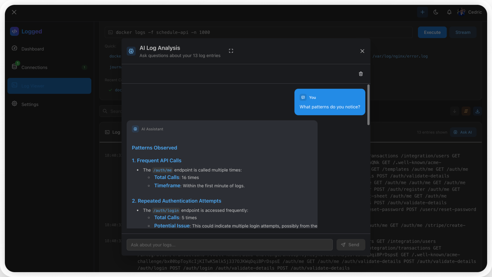
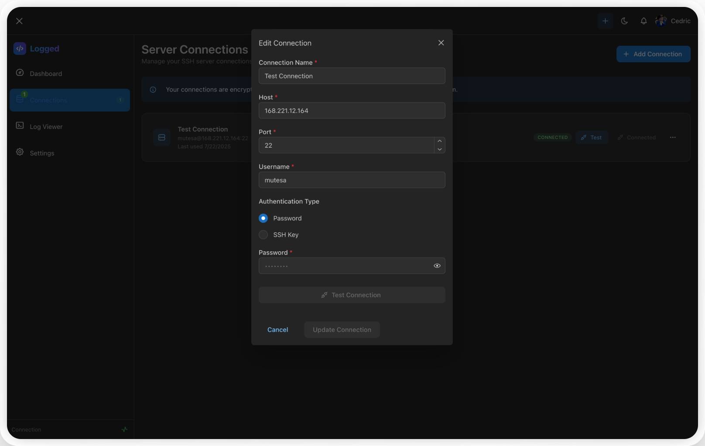

# Logged - Real-time Server Log Monitoring

A secure, modern web application for monitoring server logs in real-time with SSH connectivity and AI-powered analysis.



## ✨ Key Features

- **🔐 Secure SSH Connections** - Connect with password or SSH keys (RSA, EC, OpenSSH)
- **📊 Real-time Log Streaming** - Live monitoring with WebSocket connectivity
- **🤖 AI Log Analysis** - GPT-powered insights and error detection
- **💾 Connection Management** - Save and encrypt multiple server credentials
- **🌙 Dark/Light Mode** - Beautiful themes that adapt to your preference
- **📥 Log Export** - Download logs in TXT or JSON format
- **🔒 Zero-Knowledge Security** - AES-256 encrypted credential storage


## 🚀 Quick Start

### Prerequisites
- Node.js 18+
- MongoDB
- Clerk account
- OpenAI API key

### Installation

```bash
# Clone the repository
git clone https://github.com/Mutesa-Cedric/logged.git
cd logged

# Install dependencies
cd server && pnpm install
cd ../client && pnpm install

# Set up environment variables
cp server/.env.example server/.env
cp client/.env.example client/.env.local

# Start development servers
cd server && pnpm dev    # Backend (port 5000)
cd client && pnpm dev    # Frontend (port 3000)
```

## 📱 Screenshots

### Dashboard & Log Monitoring


### AI-Powered Analysis


### Connection Management



## 🔧 Usage

1. **Add a Server Connection**
   - Click "Add Connection" 
   - Enter server details (host, port, username)
   - Choose authentication: Password or SSH Key
   - Test and save connection

2. **Monitor Logs**
   - Select a saved connection
   - Choose log command or file path
   - View real-time streaming logs
   - Use filters and search

3. **AI Analysis**
   - Click "Ask AI" while viewing logs
   - Ask questions like "What errors do you see?"
   - Get instant insights and recommendations

## 🛡️ Security

- **AES-256 Encryption** - All credentials encrypted client-side
- **Zero-Knowledge Architecture** - Server never sees plaintext passwords
- **Secure SSH** - Support for modern SSH algorithms and key formats
- **Authentication** - Clerk-powered auth with guest mode

## 🏗️ Tech Stack

- **Frontend**: React, TypeScript, Mantine, TanStack Query
- **Backend**: Node.js, Express, Prisma
- **Real-time**: Socket.IO
- **AI**: Vercel AI SDK, OpenAI
- **SSH**: SSH2
- **Database**: MongoDB

## 📄 License

MIT License - see [LICENSE](LICENSE) for details.

---

**Built with ❤️ for developers who need reliable log monitoring on the web**